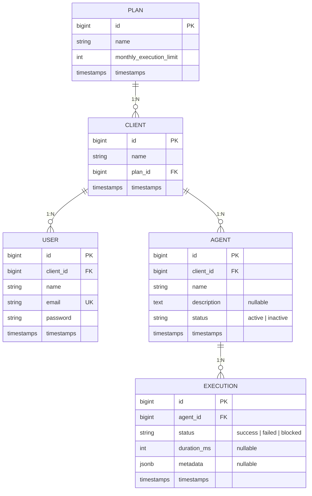

# Desafio Técnico Rotik — Painel de Monitoramento de Agentes de IA

Painel para acompanhar o uso dos agentes de IA por cliente: consumo do mês contra o
limite do plano, bloqueio de novas execuções quando o limite estoura e histórico por
agente. Backend em Laravel 13 (API REST) e frontend em React com TypeScript.

**Links:**

- Painel: https://desafio-tecnico-rotik.vercel.app
- API: https://desafio-tecnico-rotik-production.up.railway.app
- Documentação da API (OpenAPI): https://desafio-tecnico-rotik-production.up.railway.app/docs/api

**Usuários para teste** (senha `password` para todos):

| E-mail | Cenário |
| --- | --- |
| `ana@acme.test` | consumo tranquilo, com histórico do mês passado |
| `bruno@globex.test` | 85% do limite, aparece o alerta |
| `carla@initech.test` | limite estourado, agentes bloqueados |
| `dani@umbrella.test` | cliente sem nenhum agente ainda |

Sobre a stack: trabalho no dia a dia com Laravel, e como a Rotik usa Laravel,
Node/TypeScript e PostgreSQL, mantive tudo dentro da stack de vocês. O frontend segue
a recomendação do briefing (React).

---

## Etapa 0 — Discovery

O briefing deixa bastante coisa em aberto de propósito. Antes de escrever código,
listei as perguntas que eu faria ao time de produto e o que decidi assumir na falta
de resposta.

**1. O painel é para o time de CS ou para o próprio cliente usar?**

O texto fala em "fácil de usar pelo nosso time de CS", mas logo depois exige que "um
cliente não pode ver dados de outro" o que só faz sentido se existirem usuários de
clientes. Segui o modelo em que cada usuário pertence a um cliente e enxerga apenas os
dados dele, com uma Policy garantindo o isolamento. Uma visão interna para o CS (um
perfil admin que enxerga todos os clientes e escolhe qual ver) ficou como evolução:
seria um bypass na Policy e um seletor na tela, sem mudar a modelagem. Preferi
garantir primeiro o requisito de segurança, que é o inegociável dos dois.

**2. O limite é por cliente ou por agente?**

Assumi por cliente. O briefing fala no "limite de execuções do plano contratado", e o
plano é do cliente então o que conta é a soma das execuções de todos os agentes
dele no mês.

**3. "Mês" é mês-calendário ou ciclo de contrato?**

Fui de mês-calendário: vira todo dia 1º, em UTC. É mais simples de implementar, de
explicar para o CS e de consultar no banco. Se um dia precisar ser pelo aniversário da
assinatura, vai exigir guardar a data-base do contrato; deixei isso anotado nos riscos.

**4. Estourou o limite: bloqueia de verdade ou só avisa?**

O próprio briefing hesita ("deveria parar de responder, ou pelo menos a gente precisa
saber que isso aconteceu"). Acabei fazendo os dois: a API rejeita a execução com HTTP
429, registra a tentativa com status `blocked` e loga o evento. Registrar a tentativa
foi uma escolha deliberada — assim dá para ver o quanto cada cliente está batendo no
teto depois de bloqueado, o que é um bom argumento para o comercial oferecer upgrade.

**5. O que significa "perto de estourar"?**

Defini 80%: a barra de consumo fica amarela a partir daí e vermelha aos 100%. É um
número chutado com base no que costumo ver em quotas de API, e é trivial de ajustar.

**6. Quem registra as execuções e o que uma execução carrega?**

Assumi que é o runtime dos agentes chamando a API (no desafio, simulei isso pelo
painel e pelos seeders). O payload ficou no mínimo necessário: status
(`success`/`failed`), duração em ms e um JSON livre de metadados. Tokens consumidos,
custo e transcript da conversa ficaram de fora do MVP.

**7. E se o cliente trocar de plano no meio do mês?**

Vale sempre o plano atual no momento da execução, sem pro-rata. Upgrade desbloqueia na
hora (o limite novo é maior), downgrade pode bloquear na hora. Simples e previsível.

**8. O alerta precisa chegar por algum canal (e-mail, Slack)?**

No MVP o alerta é visual no painel, mais um log estruturado no backend. Como o
bloqueio dispara um evento (`ExecutionLimitReached`), mandar e-mail ou mensagem no
Slack depois é só adicionar um listener, sem mexer na regra de negócio.

### Entidades que identifiquei

Plan (carrega o limite mensal de execuções), Client (pertence a um plano), User (quem
autentica no painel, pertence a um cliente), Agent (pertence a um cliente) e Execution
(pertence a um agente). Consumo mensal e bloqueio não viraram colunas: são calculados
a partir das execuções do mês corrente. Explico o porquê na modelagem.

### O que entrou no MVP

Autenticação por token com isolamento por cliente; cadastro, listagem (com consumo) e
detalhe de agentes; registro de execução com a regra de bloqueio por limite; histórico
paginado; e o painel React com barra de consumo, cadastro, histórico e indicação
visual de alerta e bloqueio.

### O que ficou de fora, e por quê

- Visão multi-cliente para o CS: é aditiva, dá para colocar depois sem refazer nada
  (ver pergunta 1).
- Notificações por e-mail/Slack: o evento já existe, falta só o listener (pergunta 8).
- Billing, pro-rata, troca de plano pelo próprio cliente: os planos são dados seedados;
  gestão comercial não é o problema que o briefing descreve.
- Edição e exclusão de agentes: o briefing pede "cadastrar" e "ver". Deleção abre
  discussões (o que fazer com o histórico?) que não bloqueiam o valor da entrega.
- Custo/tokens por execução: seria útil, mas o limite do briefing é em execuções.

### Riscos que deixei em aberto de propósito

- Fuso horário da virada do mês: assumi UTC. Se algum cliente reclamar que o mês dele
  "virou mais cedo", a mudança fica concentrada na query de consumo.
- Crescimento da tabela de execuções: a contagem em tempo real com índice atende o
  MVP; o desenho da evolução (contador agregado) está na Etapa 1 e não muda a API.
- Idempotência: sem chave de idempotência, um retry do cliente conta duas vezes.
  Aceitável por ora, mas anotado.
- Rate limiting de infraestrutura é outra coisa, diferente do limite de plano. Só o
  segundo é regra de negócio; o primeiro fica para uma produção de verdade.

---

## Etapa 1 — Modelagem de dados



### Decisões de modelagem

O limite mensal vive só em `plans`. Não copiei o valor para `clients` nem `agents`:
se o plano muda, o limite novo vale imediatamente (foi o que assumi na pergunta 7).
O preço disso é não ter histórico de "qual era o limite no mês passado" se billing
retroativo virar requisito, entra uma tabela de histórico de plano, mas não agora.

Bloqueio não é coluna. Não existe `is_blocked` em lugar nenhum: um cliente está
bloqueado quando a contagem de execuções do mês corrente alcança o limite do plano.
Fiz assim porque coluna de estado derivado é bug esperando para acontecer alguém
precisa lembrar de desbloquear todo dia 1º, e qualquer falha nesse processo deixa o
dado mentindo. Calculando, a virada do mês se resolve sozinha. O custo é contar a
cada consulta, o que o índice abaixo resolve bem no volume de um MVP.

Índices: o mais importante é o composto `executions (agent_id, created_at)`, que
serve os dois acessos quentes o histórico paginado por agente e a contagem do mês.
Também indexei as FKs (`clients.plan_id`, `users.client_id`, `agents.client_id`),
porque o Postgres, diferente do MySQL, não faz isso sozinho. E `users.email` é unique.

Sobre como calcular o "uso mensal" de forma performática: implementei a contagem em
tempo real (um COUNT servido pelo índice composto), que é exata, não tem estado para
dessincronizar e responde em milissegundos no volume esperado de um MVP. Se a escala
chegar a milhões de execuções por mês, esse COUNT no caminho da escrita vira gargalo;
o plano B, que deixei desenhado mas não implementei, é uma tabela
`monthly_usages (client_id, period, count)` com incremento atômico na mesma transação
do INSERT. A leitura vira O(1) e o contrato da API não muda.

Concorrência: duas execuções simultâneas quando resta uma vaga no limite poderiam
ambas ler "ainda cabe" e ambas gravar. Resolvi com transação e `SELECT ... FOR UPDATE`
na linha do cliente, o que serializa o par verificação + INSERT para execuções do
mesmo cliente sem travar clientes diferentes entre si.

Os status são `string` no banco com Enum do PHP na aplicação. Evitei o tipo ENUM
nativo do Postgres porque alterar valores dele em produção é um DDL chato; validar na
borda (FormRequest + cast do Eloquent) dá a mesma garantia com menos atrito.

---

## Decisões de arquitetura

No backend usei os blocos que costumo usar em API Laravel: rotas versionadas em
`/api/v1`, Form Requests para validação, API Resources para serialização, Policies
para autorização (é a Policy que garante que um cliente não vê dados do outro) e
Actions para regra de negócio a `RegisterExecutionAction` concentra a regra central
do desafio e dá para testá-la sem passar pelo HTTP. O bloqueio dispara um evento com
um listener que escreve log estruturado; a tentativa rejeitada volta como 429 com o
mesmo formato `{message, errors}` dos erros de validação, então o frontend trata tudo
igual.

Autenticação ficou com o Sanctum emitindo Bearer token. Cheguei a considerar session
cookies (o modo SPA do Sanctum), mas isso exige front e API no mesmo domínio, e aqui
o deploy é Vercel + Railway. JWT puro seria mais uma dependência para resolver um
problema que o Sanctum já resolve.

No frontend, o único estado global de verdade é a sessão, que ficou num Context. Os
dados de servidor (agentes, execuções, consumo) vivem no cache do TanStack Query, que
já me dá retry, invalidação e o `keepPreviousData` na paginação de graça. Formulário
é `useState` local mesmo. Não usei Redux porque não sobrou nada para ele fazer.
Sobre performance: `React.memo` nos cards da listagem, `staleTime` de 30s para não
refazer fetch a cada navegação, e paginação no servidor. Acessibilidade básica está
espalhada pelos componentes: labels ligados aos inputs, `role="alert"` nas mensagens
de erro, `aria-invalid` e `aria-describedby` nos campos, `role="progressbar"` na
barra de consumo.

## Como rodar localmente

Precisa de Docker (para o Sail) e Node 22+.

```bash
# Backend
cp .env.example .env            # já aponta para o Postgres do Sail
docker run --rm -v "$(pwd)":/var/www/html -w /var/www/html \
  laravelsail/php84-composer:latest composer install
./vendor/bin/sail up -d
./vendor/bin/sail artisan key:generate
./vendor/bin/sail artisan migrate --seed
# API em http://localhost — doc em http://localhost/docs/api

# Frontend (em outro terminal)
cd frontend
npm install
cp .env.example .env            # VITE_API_URL=http://localhost/api/v1
npm run dev
# Painel em http://localhost:5173
```

Testes e lint:

```bash
./vendor/bin/sail artisan test --compact
./vendor/bin/sail bin pint --dirty
cd frontend && npm run lint && npm run build
```

## Bugs que encontrei pelo caminho (Etapa 5)

**O rollback que engolia a tentativa bloqueada.** Na primeira versão da
`RegisterExecutionAction`, eu lançava a exception de limite dentro do
`DB::transaction()`. A API respondia 429 certinho, mas o teste que verificava se a
tentativa bloqueada ficou gravada falhava: o registro sumia do banco. Demorei um
pouco para ver que o throw dentro do closure faz o Laravel dar rollback em tudo,
inclusive no INSERT da tentativa que eu tinha acabado de fazer. A correção foi o
closure só retornar o resultado, deixar a transação commitar, e disparar o evento e a
exception depois. O teste que me pegou virou o teste de regressão disso.

**`Route [login] not defined` só no navegador.** Acessando uma rota protegida sem
token pelo navegador, tomava um 500 com essa mensagem. Nos testes nunca aparecia,
porque `getJson()` manda `Accept: application/json`. Sem esse header, o middleware de
autenticação tenta redirecionar o visitante para uma página de login que não existe
numa API pura. Corrigi com `redirectGuestsTo` devolvendo `null` para `api/*` e
escrevi um teste usando `get()` sem header, do jeito que o navegador faz.

**Mixed content atrás do proxy, já no deploy.** Em produção, a doc OpenAPI e os links
de paginação saíam com `http://` e o navegador bloqueava as chamadas. O TLS termina
no proxy do Railway, então o Laravel enxergava a requisição como HTTP. Descobri
olhando os headers no DevTools; a correção foi confiar no proxy
(`trustProxies(at: '*')`) e conferir o esquema no `APP_URL`.

## Como eu monitoraria isso em produção

Não implementei, mas acompanharia:

- Saúde da aplicação: uptime do endpoint `/up`, taxa de 5xx e latência p95 por
  endpoint. O `POST /executions` merece atenção especial por causa da transação com
  lock.
- Métricas de negócio: bloqueios por cliente por dia (um pico ali é ou oportunidade
  de upgrade ou plano mal dimensionado), percentual de clientes acima de 80% do
  limite e execuções por minuto.
- Banco: conexões ativas, tempo de espera em locks (se a contenção do
  `lockForUpdate` crescer, é o sinal de migrar para o contador agregado descrito na
  Etapa 1) e crescimento da tabela de execuções.

Ferramental: Sentry para exceptions, um APM ou Prometheus/Grafana para métricas, e os
logs estruturados que a aplicação já emite em stderr agregados em algum lugar
pesquisável. Alertas para pico de 429 de limite, 5xx acima de 1% e latência fora do
normal.

## Mentalidade de produto (Etapa 7)

**1. Isso gera valor real? Para quem?** Gera, e para mais de um time. O CS passa a
responder "por que o agente parou" em segundos, que era o atrito central do briefing.
O comercial ganha a lista de contas em risco e, de quebra, as tentativas bloqueadas
saber que um cliente tentou executar 500 vezes depois de bloqueado é meio caminho para
vender upgrade. Produto ganha visibilidade de uso real. O cliente final ganha
indiretamente: bloqueio previsível e explicável em vez de falha silenciosa.

**2. Existiria solução mais simples?** Existiria. O enforcement do limite na API mais
um job diário que posta num canal do Slack a lista de clientes acima de 80% resolveria
o problema central do briefing em um dia de trabalho, sem painel nenhum. O painel se
justifica quando o CS precisa se servir sozinho e olhar histórico que é o cenário
descrito, mas vale registrar que a versão planilha-com-alerta atacaria a mesma dor.

**3. Vale investir nisso agora?** Na parte de enforcement e alerta, sim, e com
urgência: sem limite aplicado, a Rotik banca custo de inferência acima do contratado e
só descobre estouros quando vira ticket. O painel completo eu colocaria como segunda
prioridade, competindo com a confiabilidade dos próprios agentes. Na prática foi essa
ordem que segui aqui: a regra de bloqueio é a parte mais cuidada do projeto, e o
painel é uma versão mínima honesta.

**4. Como medir se deu certo?** Três métricas: tempo médio do CS para resolver
tickets de "agente parou / uso" antes e depois (esperaria cair pela metade);
percentual de clientes que chegam a 100% do limite sem nenhum contato prévio do
comercial (o alerta de 80% deveria puxar esse número para perto de zero); e usuários
ativos semanais do painel dentro do time se ninguém abre, a planilha bastava.
