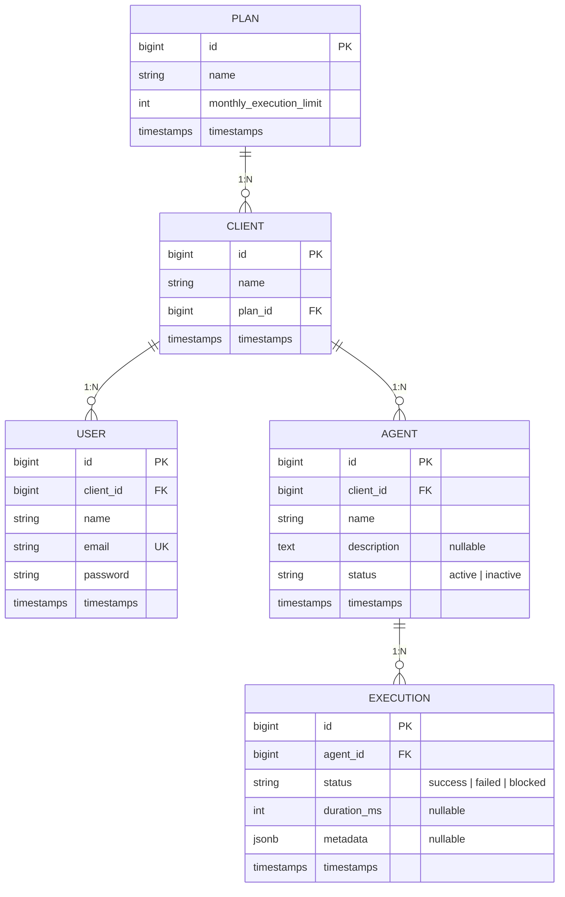

# Rotik — Painel de Monitoramento de Agentes de IA

Desafio técnico Fullstack (Laravel + React). Este README documenta o Discovery,
as decisões de arquitetura, as instruções de execução e as respostas de produto.

> **Stack:** Laravel 13 (API REST) + React/TypeScript (SPA) + PostgreSQL.
> A Rotik usa Laravel, Node/TS e PostgreSQL — escolhi essa combinação para
> demonstrar afinidade com a stack real do time.

---

## Etapa 0 — Discovery

O briefing é intencionalmente incompleto. Abaixo, as perguntas que eu faria ao
stakeholder e a suposição que adotei para cada uma na ausência de resposta.

### Perguntas ao stakeholder & assumptions

**1. Quem usa o painel: o time de CS interno (vendo todos os clientes) ou cada
cliente vendo os próprios dados?**
O briefing diz "fácil de usar pelo nosso time de CS", mas também exige que "um
cliente não pode ver dados de outro" — o que implica usuários de clientes.
➜ **Assumption:** modelei o sistema *client-scoped*: cada usuário pertence a um
cliente e só enxerga os dados dele (Policy garante o isolamento). A visão
multi-cliente para CS é uma evolução natural (role `admin` com bypass na
Policy + seletor de cliente no painel) e está documentada como fora do MVP.
Essa ordem faz sentido porque o isolamento é o requisito de segurança
inegociável; a visão agregada é aditiva.

**2. O limite mensal é por cliente (soma de todos os agentes) ou por agente?**
➜ **Assumption:** por **cliente**. O briefing diz "quando *um cliente* está
perto de estourar o limite de execuções *do plano contratado*" — o plano é do
cliente, então o consumo que importa é o agregado de todos os agentes dele.

**3. "Mês" é mês-calendário ou ciclo de contrato (aniversário da assinatura)?**
➜ **Assumption:** mês-calendário (reseta todo dia 1º, UTC). É mais simples de
implementar, de explicar para o CS e de consultar no banco. Ciclo por
aniversário exigiria armazenar a data-base do contrato — anotado como risco.

**4. Ao estourar o limite: bloquear de fato ou apenas sinalizar?**
O briefing hesita ("deveria parar de responder, *ou pelo menos* a gente
precisa saber").
➜ **Assumption:** fiz os dois — a API **rejeita** novas execuções com HTTP 429
**e registra a tentativa** com status `blocked`, além de disparar um evento
logado. Assim o CS tem visibilidade do quanto o cliente está "batendo no teto"
(dado valioso para upsell), e o comportamento é reversível por configuração se
o produto decidir só sinalizar.

**5. O que significa "perto de estourar"? Qual o threshold do alerta?**
➜ **Assumption:** alerta visual no painel a partir de **80%** do limite
(amarelo) e estado bloqueado a 100% (vermelho). 80% é convenção comum de
quota; o valor é trivial de ajustar.

**6. Quem registra as execuções e o que uma execução carrega?**
➜ **Assumption:** a execução é registrada via API pelo runtime dos agentes
(simulado aqui pelo painel/seeders). Payload mínimo: status
(`success`/`failed`), duração em ms e metadados livres (JSON). Tokens, custo e
transcript ficam fora do MVP.

**7. Mudança de plano no meio do mês: como fica o limite?**
➜ **Assumption:** o limite avaliado é sempre o do plano **atual** do cliente no
momento da execução, sem pro-rata. Upgrade desbloqueia imediatamente (o novo
limite é maior); downgrade pode bloquear imediatamente. Simples e previsível.

**8. Alertas devem chegar por algum canal (e-mail, Slack)?**
➜ **Assumption:** no MVP o alerta é visual no painel + log estruturado no
backend. A arquitetura usa Event/Listener no bloqueio, então plugar uma
Notification (e-mail/Slack) depois é adicionar um listener, sem tocar na regra
de negócio.

### Entidades identificadas

- **Plan** — plano comercial; carrega o `monthly_execution_limit`.
- **Client** — empresa cliente da Rotik; pertence a um Plan.
- **User** — pessoa que autentica no painel; pertence a um Client.
- **Agent** — agente de IA configurado por um Client; tem status (ativo/inativo).
- **Execution** — uma chamada de um Agent; tem status (`success`/`failed`/`blocked`).
- **Consumo mensal / Bloqueio** — conceitos **derivados**, não armazenados:
  consumo = execuções do cliente no mês corrente; bloqueado = consumo ≥ limite.
  (Justificativa na Etapa 1.)

### Escopo do MVP

**Dentro:**
- Auth por token (Sanctum) + isolamento por cliente (Policy).
- CRUD de agentes (criar, listar com consumo, detalhar).
- Registro de execução com a regra de bloqueio por limite (regra central).
- Histórico de execuções paginado.
- Painel React: lista com % de consumo, cadastro, histórico, indicação visual
  de alerta (≥80%) e bloqueio (100%).

**Fora (e por quê):**
- Visão CS multi-cliente — evolução aditiva; o requisito de segurança
  (isolamento) vem primeiro. (pergunta 1)
- Notificações externas (e-mail/Slack) — o Event já existe; é só plugar
  listener. (pergunta 8)
- Billing, pro-rata, troca de plano self-service — o plano é dado seedado;
  gestão comercial não é o problema do briefing.
- Edição/exclusão de agentes — o briefing pede "cadastrar" e "ver"; deleção
  envolve decisões (o que fazer com o histórico?) que não bloqueiam o valor.
- Tokens/custo por execução — métrica útil, mas o limite do briefing é em
  execuções.

### Riscos e ambiguidades deixados de fora (conscientemente)

- **Fuso horário da virada do mês** — assumo UTC. Se clientes cobrarem "meu mês
  virou mais cedo/tarde", trocar por timezone do cliente é mudança localizada
  na query de consumo.
- **Crescimento da tabela de execuções** — contagem em tempo real com índice
  atende o MVP; a evolução (contador mensal agregado) está desenhada na
  Etapa 1 e não muda o contrato da API.
- **Idempotência do registro de execução** — sem chave de idempotência, um
  retry do cliente pode contar duas vezes. Aceitável no MVP; anotado.
- **Rate limiting de infraestrutura** (proteção de abuso) ≠ limite de plano.
  Só o segundo é regra de negócio; o primeiro fica para produção real.

---

## Etapa 1 — Modelagem de dados

### Decisões de modelagem

**Normalização.** O `monthly_execution_limit` vive apenas em `plans` — única
fonte de verdade. Nada de copiar o limite para `clients` ou `agents`: se o
plano muda, o novo limite vale imediatamente (assumption 7 do Discovery).
O trade-off consciente é não ter histórico de "qual era o limite no mês X";
se billing retroativo virar requisito, a evolução é uma tabela
`client_plan_history` — fora do MVP.

**Bloqueio é estado derivado, não coluna.** Não existe `is_blocked` em
`agents` ou `clients`. Um cliente está bloqueado quando
`COUNT(execuções do mês corrente) >= limite do plano`. Isso elimina uma
classe inteira de bugs: ninguém precisa "lembrar de desbloquear" na virada do
mês, nem existe risco de coluna dessincronizada com a realidade. O custo é
calcular o consumo a cada leitura/escrita — mitigado pelo índice abaixo.

**Índices relevantes.**
- `executions (agent_id, created_at)` — índice composto que atende os dois
  acessos quentes: histórico paginado por agente (ordenado por data) e
  contagem mensal (range scan por período). É o índice mais importante do
  sistema.
- FKs indexadas: `clients.plan_id`, `users.client_id`, `agents.client_id`.
- `users.email` unique (login).

**"Uso mensal" performático: contagem em tempo real vs. agregação.**
- **MVP (implementado): contagem em tempo real.** O consumo do cliente é um
  `COUNT` sobre `executions` juntando os agentes do cliente, filtrado pelo mês
  corrente, servido pelo índice composto. Para o volume de um MVP (milhares a
  centenas de milhares de execuções/mês por cliente), isso responde em
  milissegundos, é sempre exato e não tem estado para dessincronizar.
- **Evolução (documentada, não implementada): contador agregado.** Em escala
  (milhões de execuções/mês), a contagem no caminho crítico da escrita vira
  gargalo. O desenho: tabela `monthly_usages (client_id, period, count)` com
  `UNIQUE (client_id, period)` e incremento atômico
  (`UPDATE ... SET count = count + 1`) na mesma transação do INSERT da
  execução. A leitura vira O(1). O contrato da API não muda — só a
  implementação interna do cálculo de consumo.

**Concorrência (regra central).** Duas execuções simultâneas quando resta 1
unidade do limite podem ambas ler "ainda cabe" e ambas gravar — estourando o
limite. A verificação e o INSERT acontecem dentro de uma transação com lock
(`SELECT ... FOR UPDATE` na linha do cliente), serializando execuções
concorrentes do mesmo cliente. Detalhes na Etapa 2.

**Enums como string + PHP Enum.** `status` é `string` no banco, validada por
Enums do PHP (`AgentStatus`, `ExecutionStatus`) na aplicação. Evito o tipo
`ENUM` nativo do Postgres porque alterar valores dele exige DDL chato em
produção; a validação na borda da aplicação (FormRequest + cast do Eloquent)
dá a mesma garantia com flexibilidade.
